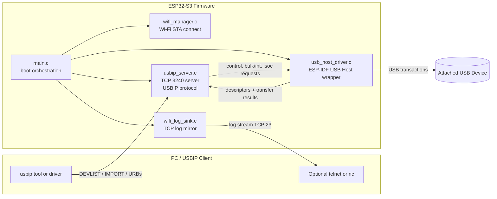
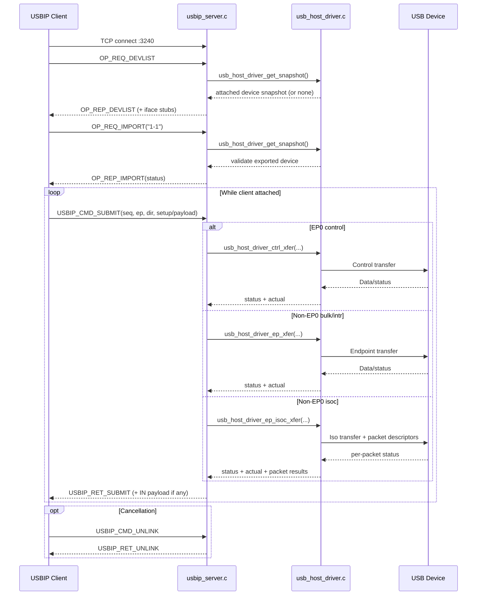
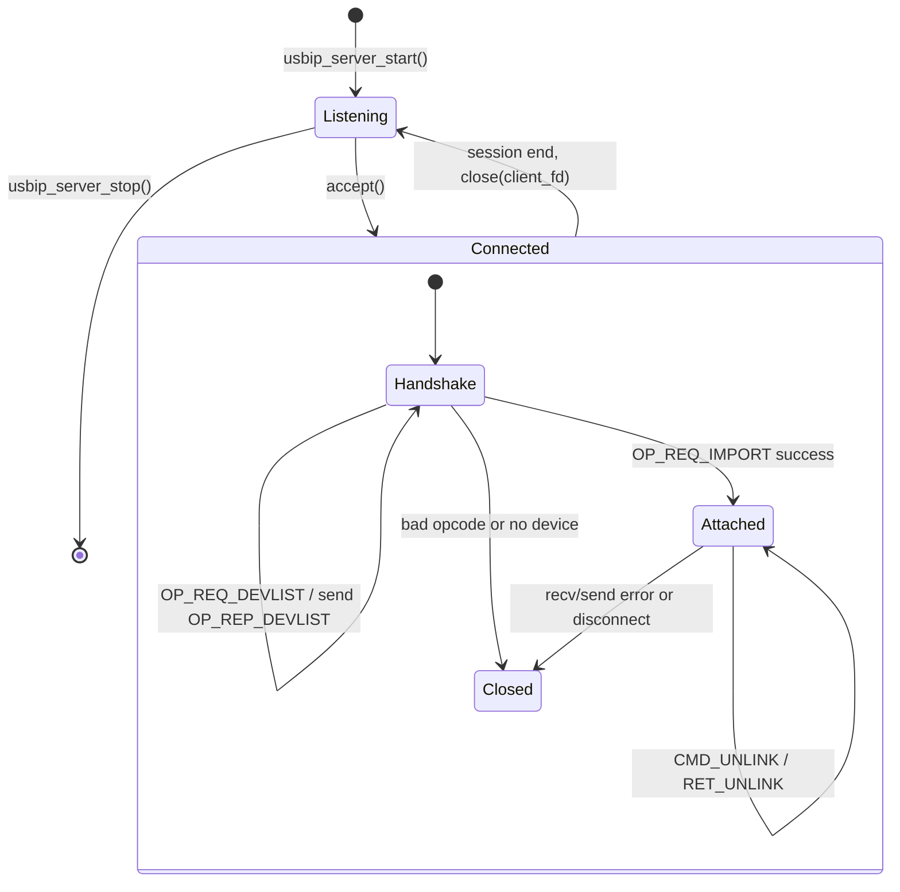
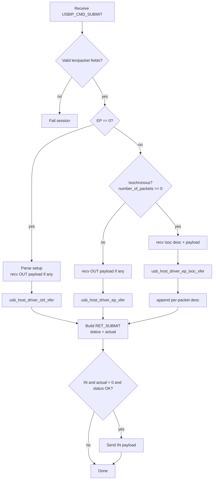

# ESP32-S3 USB/IP Host (Experimental)

USB/IP host firmware for ESP32-S3 that exports one attached USB device over Wi-Fi.

This project is focused on practical bring-up and debugging (especially CDC/UART bridge devices like CP210x) and includes Wi-Fi log streaming so you can debug without USB serial.

## Status

- Target: `esp32s3` (USB Host supported)
- USB/IP handshake: implemented (`DEVLIST`, `IMPORT`)
- Transfer support:
  - Control (EP0): implemented
  - Bulk/Interrupt: implemented
  - Isochronous: implemented (basic)
- Logging over Wi-Fi: implemented (TCP/telnet log server)
- Current architecture: single exported device (`1-1`)

Notes:
- This is still experimental firmware.
- Some host/client combinations may still require further work (especially high-load CDC/open/close edge cases).

## Repository Layout

- `main.c`: app startup flow (Wi-Fi -> logging -> USB host -> USB/IP server)
- `wifi_manager.c`: Wi-Fi station connect/disconnect
- `wifi_log_sink.c`: TCP log server over Wi-Fi
- `usb_host_driver.c`: ESP-IDF USB Host wrapper (descriptor parse, control/bulk/int/iso transfers)
- `usbip_server.c`: USB/IP protocol server and URB processing
- `include/`: public headers
- `Kconfig.projbuild`: project settings

## Architecture Diagrams (GitHub Mermaid)

The diagrams below are rendered by GitHub in Markdown preview.

### 1) Firmware Runtime Topology



### 2) USB/IP Handshake + URB Loop



### 3) Per-Client Session State Machine



### 4) CMD_SUBMIT Dispatch Logic



## Requirements

- ESP-IDF v5.5 (or compatible with this project)
- ESP32-S3 board with USB OTG host wiring/power
- Stable 5V power path for USB device side (do not power USB peripherals from weak rails)

## Configure

Use ESP-IDF menuconfig (or edit `sdkconfig` through menuconfig):

- Wi-Fi:
  - `USBIP_WIFI_SSID`
  - `USBIP_WIFI_PASSWORD`
- USB/IP:
  - `USBIP_SERVER_PORT` (default 3240)
- Logging:
  - `USBIP_WIFI_LOG_ENABLE` (enable TCP log server)
  - `USBIP_WIFI_LOG_PORT` (default 23)
  - `USBIP_DEBUG_LOGS` (enable verbose debug-level tags)

## Build / Flash

### With ESP-IDF extension (recommended in this workspace)

- Build: use ESP-IDF `build`
- Flash: use ESP-IDF `flash`
- Monitor (if serial available): use ESP-IDF `monitor`

### CLI (if using idf.py)

From project root:

```bash
idf.py set-target esp32s3
idf.py build
idf.py -p <PORT> flash
```

## Use USB/IP

Assume ESP IP is `192.168.0.213`.

### Linux / WSL

```bash
usbip list -r 192.168.0.213
usbip attach -r 192.168.0.213 -b 1-1
```

### Windows

Use your USB/IP client tooling to:

- list remote devices from `192.168.0.213:3240`
- attach bus ID `1-1`

## Wi-Fi Log Streaming (No USB Serial Needed)

When `USBIP_WIFI_LOG_ENABLE=y`, firmware starts a TCP log server.

Connect from PC:

```bash
telnet 192.168.0.213 23
```

If Telnet is unavailable, any TCP client (`nc`, PuTTY raw/telnet mode) works.

## Firmware Editing Guide

### Change USB/IP protocol behavior

Edit `usbip_server.c`:

- handshake (`OP_REQ_DEVLIST`, `OP_REQ_IMPORT`)
- URB command handling (`CMD_SUBMIT`, `CMD_UNLINK`)
- network send/receive behavior and session lifecycle

### Change USB transfer implementation

Edit `usb_host_driver.c`:

- endpoint/interface discovery
- control/bulk/int/iso transfer submission and timeout cleanup
- host callback and event handling

### Change debug behavior

- `main.c`: runtime log level setup
- `Kconfig.projbuild`: expose toggles
- `wifi_log_sink.c`: network log transport

## Known Limits / Design Constraints

- Single exported device model (one `busid`)
- No full multi-device/hub manager yet
- UNLINK behavior is basic and may need deeper async in-flight URB tracking for best stability

## Safety / Hardware Notes

- Use a robust 5V supply path for USB host mode.
- Prefer powered USB hub for power-hungry peripherals.
- Avoid hot-plug stress during unstable bring-up.
- If board browns out or overheats, stop and verify wiring/power immediately.

## Quick Resume Checklist (When Returning to This)

1. Verify board power path and OTG wiring first.
2. Build + flash latest firmware.
3. Connect Wi-Fi log telnet (`<esp_ip>:23`).
4. Verify `DEVLIST` and `IMPORT` flow.
5. Re-test attach/open sequence for your target device.
6. Capture logs around the first stall/disconnect and iterate in `usbip_server.c` + `usb_host_driver.c`.

## License

MIT (per source headers).